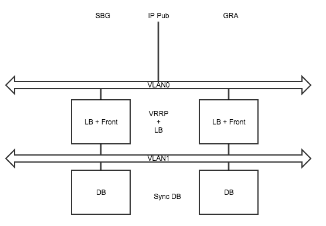

# Terraforming OVH Public Cloud 

This repo contains commons resources to interact with [OVH Public Cloud](https://www.ovh.com/world/public-cloud/instances/) using [Terraform](https://www.terraform.io/). 

# Description

We provide a step-by-step guide on how to use [Terraform](https://www.terraform.io/) with [OVH Public Cloud](https://www.ovh.com/world/public-cloud/instances/).

This is mainly for learning purpose but the use case presented can be use to deploy real infrastructures. Here, we'll deploy a web application on multiple nodes and multiple regions to be able to address important loads and provide redondency on two separated datacenters. We'll use the well known Wordpress blog CMS to keep it simple.

# Journey

**Introduction: Terraform basics**
- [Setup and configuration](./journey/0-simple-terraform/README.md)
- [Variables and outputs](./journey/1-simple-terraform-vars/README.md)
- [State and best practices](./journey/2-simple-terraform-state/README.md)

**Terraforming OVH Public Cloud resources**
- [Creating your first instance](./journey/3-simple-public-instance/README.md)
- [Advanced instance setings](./journey/4-advanced-public-instances/README.md)

**From test to production environments**
- [Secure your instances](./journey/5-private-instances/README.md)
- [Multiple environments, manage modules](./journey/6-intro-modules/README.md)
- [Deploy a multi-region architecture](./journey/7-multiregion/README.md)

**Moving forward with Terraform best practices**
- WIP: Versionning
- WIP: Workspace

**Scalling and rolling upgrade, let the magic happen**
- WIP: Scale Up/Down
- WIP: Rolling Upgrade

# Schema

# License

The 3-Clause BSD License. See [LICENSE](./LICENSE) for full details.

